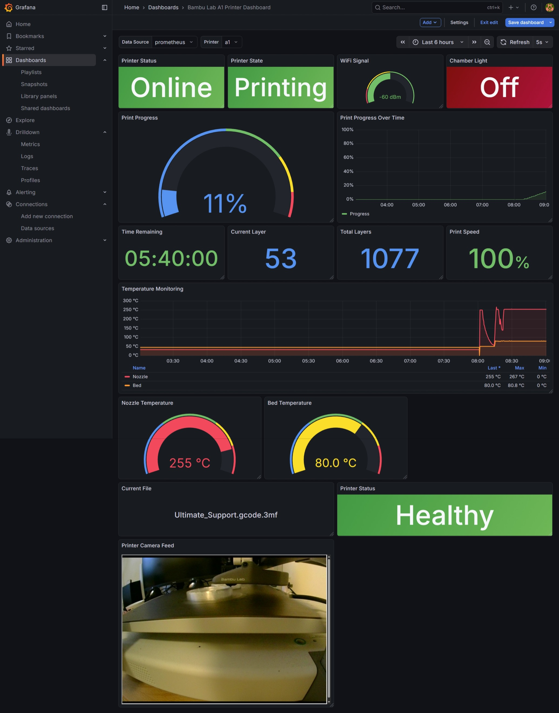

# Bambulab Prometheus Exporter

A lightweight Prometheus exporter for Bambu Lab 3D printers, designed for LXC/bare-metal deployment in homelabs.

<p align="center">
  
</p>

## Features

**Native LXC Support** - No Docker required, runs as systemd service  
**Comprehensive Metrics** - Temperature, progress, speeds, print statistics  
**Local Mode** - Direct MQTT connection to printer on your LAN  
**Lightweight** - Minimal resource usage, perfect for LXC containers  
**Prometheus Native** - Standard `/metrics` endpoint  
**Multi-Printer Support** - Monitor multiple printers simultaneously  
**Live Camera Feed** - Integrated camera viewer on port 9101

**Why Standalone LXC?**
- Clean separation - each container has one job
- Easy troubleshooting - isolated logs and processes
- Independent updates - won't affect Prometheus/Grafana
- Better security - exporter can't access monitoring data
- Resource isolation - no competition for CPU/RAM

## Supported Printers

- Bambu Lab A1 / A1 Mini
- Bambu Lab P1P / P1S
- Bambu Lab X1 / X1C (partial support)

## Requirements

### System Requirements

| Component | Requirement |
|-----------|-------------|
| **OS** | Debian 12+ or Ubuntu 22.04+ LXC |
| **CPU** | 1 core minimum |
| **RAM** | 512MB minimum |
| **Disk** | 2GB minimum |
| **Python** | 3.10+ |
| **Network** | LXC must reach printer IP |
| **Access** | Root required for installation |

### Printer Requirements

> [!IMPORTANT]  
> Your Bambu Lab printer must have **both** LAN Only and Dev Mode enabled:

- **LAN Only** - Enables local network communication
- **Dev Mode** - Enables MQTT access (required for this exporter)


### Network Ports

| Port | Purpose | Protocol |
|------|---------|----------|
| **9100** | Prometheus metrics endpoint | HTTP |
| **9101** | Camera feed (live JPEG stream) | HTTP |

## Quick Start

**Choose your installation method:**
- **Option A: Automated** - Use `install.sh` script (recommended, handles everything automatically)
- **Option B: Manual** - Step-by-step installation (full control, see all steps below)

### 1. Get Printer Credentials

> [!CAUTION]  
> **Both LAN Only and Dev Mode are required!**  
> 
> Without Dev Mode, the printer will block MQTT connections and the exporter cannot connect.

On your Bambu Lab printer:

1. Go to **Settings** → **Network**
2. **Enable Dev Mode** (required - allows MQTT access)
3. Enable **LAN Only** (recommended for security)
4. Note your printer's **IP address**
5. Note the **Access Code** (shown in network settings)
6. Find your printer's **Serial Number** (on printer label or within Slicer software)

### 2. Installation in LXC

**Option A: Automated Installation (Recommended)**

```bash
# Inside LXC container as root:
cd /root
wget https://raw.githubusercontent.com/goozoon/bambulab-prometheus/main/install.sh
chmod +x install.sh
./install.sh

# The script will ask for your printer details:
# - Printer name (e.g., bambu_a1)
# - IP address
# - Access code (from printer network settings)
# - Serial number (on printer label)

# The script will automatically:
# - Enable the service for auto-start on boot
# - Start the service
# - Show status and next steps

# To manage printers later, just run the script again:
# cd /opt/bambulab-prometheus
# ./install.sh
# It will detect existing config and offer to:
#   - Add another printer
#   - Remove a printer
#   - Keep existing configuration
```

**Option B: Manual Installation (Complete Steps)**

```bash
# Create Debian/Ubuntu LXC container in Proxmox
# Recommended specs: 1 CPU core, 512MB RAM, 2GB disk

# Inside LXC container as root:

# Update system and install dependencies
apt update
apt install -y python3 python3-pip python3-venv git

# Create service user
adduser --system --group --home /opt/bambulab-prometheus --shell /bin/false bambulab-prometheus

# Clone repository
cd /opt
git clone https://github.com/goozoon/bambulab-prometheus.git
cd bambulab-prometheus

# Set ownership
chown -R bambulab-prometheus:bambulab-prometheus /opt/bambulab-prometheus

# Create virtual environment as service user
sudo -u bambulab-prometheus python3 -m venv venv

# Install dependencies as service user
sudo -u bambulab-prometheus venv/bin/pip install --upgrade pip
sudo -u bambulab-prometheus venv/bin/pip install -r requirements.txt
# This installs: bambulabs_api, prometheus-client, PyYAML, Flask, Pillow

# Configure
sudo -u bambulab-prometheus cp config.example.yaml config.yaml
nano config.yaml  # Edit with your printer details

# Install systemd service
cp systemd/bambulab-prometheus.service /etc/systemd/system/
systemctl daemon-reload
systemctl enable bambulab-prometheus
systemctl start bambulab-prometheus

# Verify service is running
systemctl status bambulab-prometheus

# View logs
journalctl -u bambulab-prometheus -f
```

### 3. Manual Configuration

Edit `/opt/bambulab-prometheus/config.yaml`, if needed:

```yaml
exporter:
  port: 9100
  log_level: INFO
  update_interval: 5  # seconds

printers:
  - name: "bambu_a1"
    ip: "192.168.1.100"
    access_code: "12345678"
    serial: "01S00A000000000"
    enabled: true
```

### 4. Configure Prometheus (On Your Prometheus Host)

> [!IMPORTANT]
> This step is performed on your **Prometheus server**, not in the exporter LXC.

> [!WARNING]
> YAML is very sensitive to spaces and indentation. Use exactly 2 spaces for each indentation level, never tabs. A single incorrect space will cause Prometheus to fail to start.

Add to your `prometheus.yml`:

```yaml
scrape_configs:
  - job_name: 'bambulab'
    static_configs:
      - targets: ['LXC_IP:9100']  # Replace LXC_IP with your exporter's IP
        labels:
          location: 'homelab'
```

**Complete Example** (if you need to see the full structure):

```yaml
# /etc/prometheus/prometheus.yml
global:
  scrape_interval: 15s
  evaluation_interval: 15s

scrape_configs:
  - job_name: 'prometheus'
    static_configs:
      - targets: ['localhost:9090']

  - job_name: 'bambulab'
    scrape_interval: 10s  # Scrape printer every 10 seconds
    static_configs:
      - targets: ['192.168.1.201:9100']  # Replace with your LXC IP
        labels:
          location: 'homelab'
          printer: 'a1'  # Optional: add custom labels
```

**After editing:**

1. **Test the configuration** before reloading:
   ```bash
   # On your Prometheus host:
   promtool check config /etc/prometheus/prometheus.yml
   ```
   
   If you see errors, fix them before proceeding!

2. **Reload Prometheus** (only if config check passed):
   ```bash
   systemctl reload prometheus
   # Or use the API:
   curl -X POST http://localhost:9090/-/reload
   ```

3. **Verify target is being scraped:**
   - Open Prometheus: `http://YOUR_PROMETHEUS_IP:9090/targets`
   - Look for `bambulab` job showing **UP** (green)
   - If DOWN (red), check the error message and verify:
     - LXC IP is correct
     - Port 9100 is accessible: `curl http://LXC_IP:9100/metrics`
     - No firewall blocking the connection

Reload Prometheus configuration:
```bash
# On your Prometheus host:
systemctl reload prometheus
# Or use the API:
curl -X POST http://localhost:9090/-/reload
```

### 5. Import Grafana Dashboard (On Your Grafana Host)

> [!IMPORTANT]
> This step is performed on your **Grafana server**, not in the exporter LXC.

Two dashboards are available:

**A1 Dashboard** (`grafana/a1-dashboard.json`) - Recommended for most users
- 15 essential panels showing key printer metrics
- Optimized for Bambu Lab A1/A1 Mini printers
- Includes: State, temperatures, progress, layers, speed, camera feed
- Excludes: Chamber temp, nozzle details (not relevant for A1)

**Comprehensive Dashboard** (`grafana/comprehensive-dashboard.json`) - Advanced users
- 19 panels showing all available metrics
- Includes chamber temperature, nozzle type/diameter
- Suitable for all Bambu Lab printers including X1/P1 series

To import:
1. In Grafana, go to **Dashboards** → **Import**
2. Upload the JSON file or paste its contents
3. Select your Prometheus data source

**Note**: If you used `install.sh`, the camera URL is already configured. For manual installations, see Camera Feed section below.

## Available Metrics

<details>
<summary><strong>📊 Click to expand full metrics list</strong></summary>

### 🌡️ Temperature Metrics
- `bambu_nozzle_temperature` - Current nozzle temperature (°C)
- `bambu_nozzle_target_temperature` - Target nozzle temperature (°C)
- `bambu_bed_temperature` - Current bed temperature (°C)
- `bambu_bed_target_temperature` - Target bed temperature (°C)
- `bambu_chamber_temperature` - Chamber temperature (°C)

### Print Progress
- `bambu_print_progress_percent` - Print completion percentage (0-100)
- `bambu_print_remaining_time_seconds` - Estimated time remaining
- `bambu_print_elapsed_time_seconds` - Time since print started
- `bambu_current_layer` - Current layer number
- `bambu_total_layers` - Total layers in print

### Speed & Movement
- `bambu_print_speed_percent` - Current print speed modifier (%)
- `bambu_fan_speed_percent{fan="part_cooling"}` - Part cooling fan speed
- `bambu_fan_speed_percent{fan="hotend"}` - Hotend fan speed
- `bambu_fan_speed_percent{fan="chamber"}` - Chamber fan speed

### Printer State
- `bambu_printer_state` - Current state (0=Idle, 1=Printing/Running, 2=Paused, 3=Finish, 4=Failed)
- `bambu_online` - Printer connectivity (1=online, 0=offline)
- `bambu_wifi_signal_strength` - WiFi signal strength (dBm)
- `bambu_error_code` - Error code (0=Healthy, >0=Error)

### Statistics
- `bambu_total_prints` - Lifetime print count
- `bambu_total_print_time_hours` - Lifetime print hours
- `bambu_print_failures_total` - Count of failed prints

### Hardware State
- `bambu_chamber_light` - Light state (0=off, 1=on)
- `bambu_ams_humidity_percent{unit="0"}` - AMS unit humidity (if equipped)

### File & Nozzle Info
- `bambu_current_file_info{filename="..."}` - Current file being printed (filename in label)
- `bambu_nozzle_info{nozzle_type="...", nozzle_diameter_mm="..."}` - Nozzle information

For complete metrics documentation, see [METRICS.md](METRICS.md)

</details>

## 📷 Camera Feed

The exporter provides a live camera feed endpoint that serves JPEG images from your printer's camera.

**Endpoints**:
- `http://your-lxc-ip:9101/camera` - Direct JPEG image
- `http://your-lxc-ip:9101/camera.html` - Auto-refreshing HTML page

Both dashboards include a camera panel that auto-refreshes every 2 seconds.

**Automatic Configuration** (if using `install.sh`):
- The installer automatically detects your LXC IP and updates the camera URLs in both dashboards
- No manual configuration needed

**Manual Configuration** (if installing manually):
1. After importing the dashboard, edit the "Printer Camera Feed" panel
2. Change `http://192.168.0.231:9101/camera.html` to your actual LXC IP address
3. Save the dashboard

**Note**: 
- Camera feed is served via HTTP, not stored in Prometheus
- Requires printer to be connected with camera access enabled
- Minimal bandwidth usage (~50KB per image)

## Architecture

### Deployment Overview

**Recommended Setup:** Deploy exporter in its own standalone LXC container for best separation of concerns, easier maintenance, and better security.

```
┌─────────────────┐
│  Bambu Lab A1   │
│ (192.168.1.100) │  Your 3D Printer
│                 │
└────────┬────────┘
         │ MQTT (Local Network)
         │ Direct connection
         │
         ▼
┌─────────────────┐
│ Exporter LXC    │  ← Deploy HERE (New Container)
│ (192.168.1.201) │     Specs: 512MB RAM, 1 CPU, 2GB Disk
│ Port: 9100      │     OS: Debian 12 / Ubuntu 22.04
│ Port: 9101      │     Camera endpoint
└────────┬────────┘
         │ HTTP /metrics
         │ Prometheus scrapes this
         │
         ▼
┌─────────────────┐
│ Prometheus LXC  │  ← Your Existing Prometheus
│ (192.168.1.200) │     Scrapes exporter every 10s
│                 │
└────────┬────────┘
         │ PromQL queries
         │
         ▼
┌─────────────────┐
│ Grafana LXC     │  ← Your Existing Grafana
│ (192.168.1.202) │     Visualizes the data
│                 │
└─────────────────┘
```

## 🔧 Troubleshooting

### Dashboard Shows "No Data"

> [!NOTE]  
> Most "No Data" issues are caused by Prometheus not scraping the exporter, or the `$printer` variable not matching your printer name.

**Quick Check:**
```bash
# On LXC - verify exporter is running and metrics are exposed
systemctl status bambulab-prometheus
curl http://localhost:9100/metrics | grep bambu_online
```

**If metrics endpoint works but dashboard shows "No Data":**
1. Verify Prometheus is scraping: `http://YOUR_PROMETHEUS:9090/targets`
   - Look for `bambulab` job showing **UP** (green)
   - If DOWN or missing, check your `prometheus.yml` configuration
2. Check Grafana data source: Configuration → Data Sources → Your Prometheus → Test
3. Wait 1-2 minutes for Prometheus to collect data
4. Check dashboard `$printer` variable has your printer name

**See [docs/TROUBLESHOOTING.md](docs/TROUBLESHOOTING.md) for detailed step-by-step debugging.**

### Exporter won't connect to printer
- Verify printer is in LAN Mode
- Check IP address is correct and printer is reachable: `ping PRINTER_IP`
- Verify access code in printer network settings
- Check exporter logs: `journalctl -u bambulab-prometheus -f`

### Metrics are stale
- Check `update_interval` in config.yaml (default: 5 seconds)
- Verify printer is powered on and connected
- Check exporter logs: `journalctl -u bambulab-prometheus -n 50`

## 💻 Development

### Running Locally

```bash
python3 -m venv venv
source venv/bin/activate
pip install -r requirements.txt
python src/exporter.py
```

### Running Tests

```bash
pip install -r requirements-dev.txt
pytest tests/
```

## 🤝 Contributing

Contributions welcome! Please:

1. 🍴 Fork the repository
2. 🌿 Create a feature branch
3. ✅ Add tests for new features
4. 📬 Submit a pull request

## License

MIT License - See [LICENSE](LICENSE) file

## Credits

Built using:
- [bambulabs_api](https://github.com/BambuTools/bambulabs_api) - Unofficial Bambu Lab API (community reverse-engineered)
- [prometheus_client](https://github.com/prometheus/client_python) - Official Prometheus Python client

### Why Not Use BambuStudio's Network Plugin?

[BambuStudio](https://github.com/bambulab/BambuStudio) (the official slicer) uses a **proprietary closed-source networking plugin** (`bambu_networking`) that is not available in their open-source repository. The BambuTools community reverse-engineered the MQTT protocol by analyzing network traffic and the open portions of BambuStudio's code, creating a fully open-source Python implementation that works directly with the printer's local MQTT interface.

## Disclaimer

This is an unofficial tool and is not affiliated with or endorsed by Bambu Lab. Use at your own risk.
